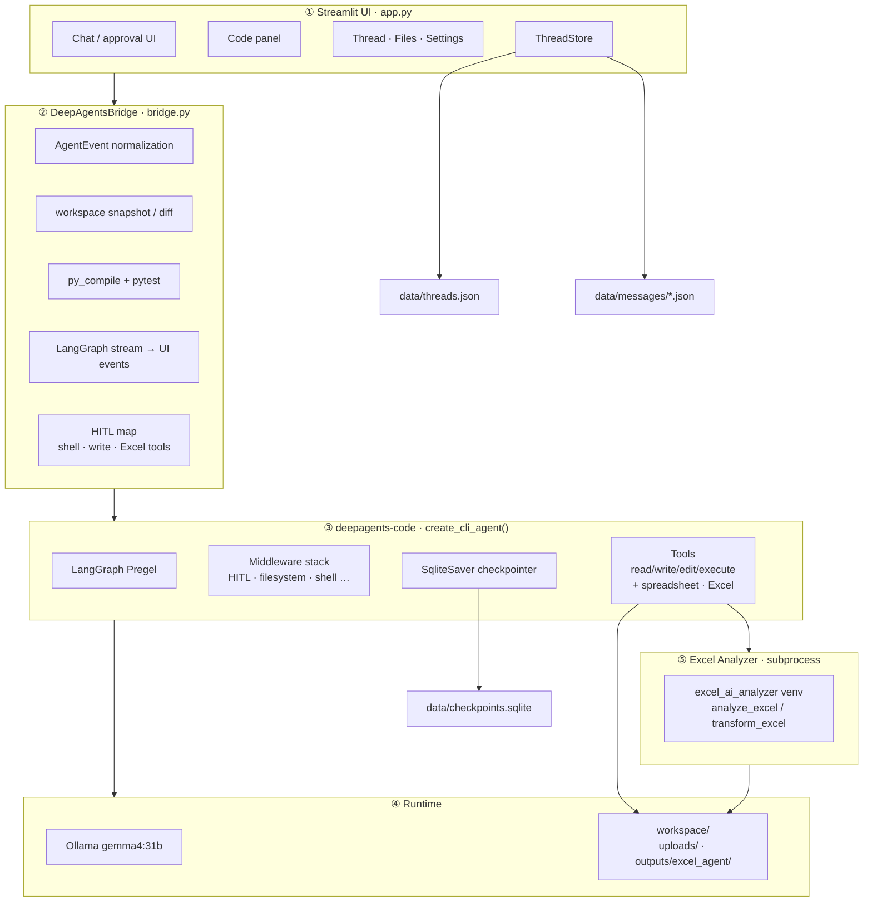

# Coding Agent

A Streamlit coding workbench. **The agent runtime is [deepagents-code](https://pypi.org/project/deepagents-code/).**

Model: Ollama `gemma4:31b`

> Korean README: [README.md](README.md)

## Architecture



## Run

```bash
curl -LsSf https://astral.sh/uv/install.sh | sh   # if needed
cd ~/coding-agent
chmod +x run_app.sh
./run_app.sh
```

Or:

```bash
uv venv .venv --python 3.12
source .venv/bin/activate
uv pip install -r requirements.txt
streamlit run app.py
```

### Workbench

Select a file in the sidebar Files explorer to open it on the right.

| Area | Description |
| --- | --- |
| **Header** | Filename · `Modified` (unsaved) · relative path. Buttons: **Changes**, **Preview**, **▶ Run**, **Save**, **⋯** |
| **Editor** | Plain files use `text_area`. `.md` uses **Preview / Source** tabs |
| **Changes** | When the agent edited files: Header **Changes** → bottom expander |
| **Terminal** | Collapsible bottom panel — command input, Run/Stop, History (separate from the agent shell) |

## Excel Analyzer integration (custom tools)

Attach Excel/CSV in chat, or use files already in the workspace.

Roles:

- **inspect_spreadsheet / read_spreadsheet**: sheet/column/structure checks (**prefer first**; in-process)
- **analyze_excel**: natural-language summary, comparison, aggregation (Analyzer venv subprocess)
- **transform_excel**: copy-preserving `extract_to_sheet` / `unmerge_cells` (subprocess). Coding Agent does not invent coordinates.
- Results are written under `workspace/outputs/excel_agent/` and can be opened/**Download**ed in Files Explorer.
- Existing shell/write HITL and Auto-approve are unchanged. With Auto-approve off,
  `analyze_excel` / `transform_excel` also pause on the same Approve/Reject panel.

Coding Agent calls `excel_ai_analyzer` in a **separate Python venv subprocess**. Bad Analyzer config does not crash the app; Excel tools return `configuration_error`.

Chat attachments are stored under `uploads/` (visible in Files, kept across chats). After attach/send, open the right-pane preview from the chat attachment buttons, the Files tree, or tool **Open** actions.

Minimum setup:

```bash
export CODING_AGENT_EXCEL_ROOT=<excel-analyzer-root>
export CODING_AGENT_EXCEL_PYTHON=<excel-analyzer-root>/.venv/bin/python
export CODING_AGENT_EXCEL_TIMEOUT=180
export CODING_AGENT_EXCEL_OUTPUT_ROOT=<project-root>/workspace/outputs/excel_agent
```

- Use inspect/read for structure, `analyze_excel` for summary/aggregation, `transform_excel` for sheet extract / unmerge.

## Runtime environment and test examples

For detailed run instructions, hardware notes, prompts, and measured results, see [EXECUTION_GUIDE.md](EXECUTION_GUIDE.md).

### Limitations

- **Terminal** is not a PTY. Interactive `input()` is not supported.
- Header **▶ Run** runs `python3 '<file>'` in Terminal. If the source uses `input()`, it warns and does not auto-run.
- **Preview** depends on file type: `.md` in Editor tabs; HTML/web apps use a separate preview mode.
- Binary files are not editable.

## References

- [https://pypi.org/project/deepagents-code/](https://pypi.org/project/deepagents-code/)
- [https://github.com/FeynmanZhou/tasking-agent](https://github.com/FeynmanZhou/tasking-agent) (DeepAgentsBridge / event-normalization UX)
- Excel Analyzer subprocess integration: [Jihei-Boun](https://github.com/Jihei-Boun) (`excel_ai_analyzer` / I2 integrate)
