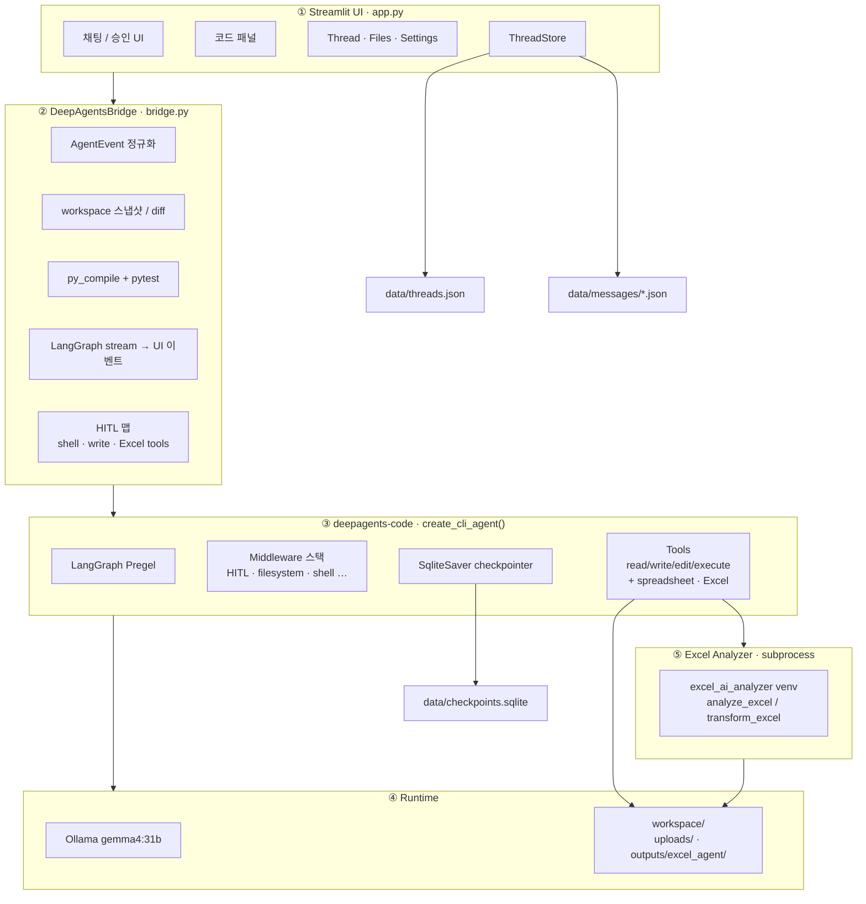

# Coding Agent

Streamlit기반 코딩 워크벤치. **에이전트 엔진은 [deepagents-code](https://pypi.org/project/deepagents-code/)** 

모델: Ollama `gemma4:31b`

> English README: [README.en.md](README.en.md)

## 구조




## 실행

```bash
curl -LsSf https://astral.sh/uv/install.sh | sh   # 없으면
cd ~/coding-agent
chmod +x run_app.sh
./run_app.sh
```

OR:

```bash
uv venv .venv --python 3.12
source .venv/bin/activate
uv pip install -r requirements.txt
streamlit run app.py
```


### Workbench

사이드바 Files에서 파일을 선택하면 오른쪽에 열립니다.


| 영역           | 설명                                                                                           |
| ------------ | -------------------------------------------------------------------------------------------- |
| **Header**   | 파일명 · `Modified`(저장 안 된 변경) · 상대경로. 버튼: **Changes**, **Preview**, **▶ Run**, **Save**, **⋯** |
| **Editor**   | 일반 파일은 `text_area`. `.md`는 **Preview / Source** 탭                                            |
| **Changes**  | 에이전트가 수정한 diff가 있을 때 Header **Changes** → 하단 expander                                        |
| **Terminal** | 하단 접이식 — 명령 입력, Run/Stop, History (에이전트 shell과 별도)                                           |


## Excel Analyzer 연동 (custom tool)

채팅 입력에서 Excel/CSV를 첨부하거나, workspace에 이미 있는 파일을 사용할 수 있습니다.
첨부 파일은 `workspace/uploads/`에 저장되며 Files에 보이고, New chat 후에도 남습니다.

역할 구분:

- **inspect_spreadsheet / read_spreadsheet**: 시트·컬럼·일부 행 등 구조와 부분 확인 (**기본 우선**, Coding Agent 프로세스)
- **analyze_excel**: 자연어 요약·비교·집계 (전용 Analyzer venv subprocess)
- **transform_excel**: 원본 보존 복사본에서 `extract_to_sheet` / `unmerge_cells` (전용 subprocess). 좌표는 Coding Agent가 만들지 않습니다.
- 결과 파일은 `workspace/outputs/excel_agent/`에 저장되며 **Files Explorer에서 열고 Download**할 수 있습니다.
- 기존 shell/write HITL·Auto-approve는 유지됩니다. Auto-approve가 꺼져 있으면
  `analyze_excel` / `transform_excel`도 **같은 Approve/Reject 패널**에서 승인합니다.

Coding Agent는 `excel_ai_analyzer`를 **별도 Python 가상환경 subprocess**로 호출합니다. Analyzer 설정이 잘못되어도 앱은 기동하며, Excel tool만 `configuration_error`를 반환합니다.

최소 설정:

```bash
export CODING_AGENT_EXCEL_ROOT=<excel-analyzer-root>
export CODING_AGENT_EXCEL_PYTHON=<excel-analyzer-root>/.venv/bin/python
export CODING_AGENT_EXCEL_TIMEOUT=180
export CODING_AGENT_EXCEL_OUTPUT_ROOT=<project-root>/workspace/outputs/excel_agent
```

- 구조 확인은 inspect/read, 요약·집계는 analyze_excel, 시트 추출·병합 해제는 transform_excel을 사용합니다.

### Limitations:

- **Terminal**은 PTY가 아닙니다. `input()` 같은 대화형 입력은 지원하지 않습니다.
- Header **▶ Run**은 `python3 '<file>'`을 Terminal에서 실행합니다. 소스에 `input()`이 있으면 경고만 표시하고 자동 실행하지 않습니다.
- **Preview**는 파일 종류에 따라 동작이 다릅니다. `.md`는 Editor 탭, HTML/웹앱은 별도 프리뷰 모드입니다.
- 바이너리 파일은 편집할 수 없습니다.

## 참고

- [https://pypi.org/project/deepagents-code/](https://pypi.org/project/deepagents-code/)
- [https://github.com/FeynmanZhou/tasking-agent](https://github.com/FeynmanZhou/tasking-agent) (DeepAgentsBridge / 이벤트 정규화 UX)
- Excel Analyzer subprocess integration: [Jihei-Boun](https://github.com/Jihei-Boun) (`excel_ai_analyzer` / I2 integrate)

