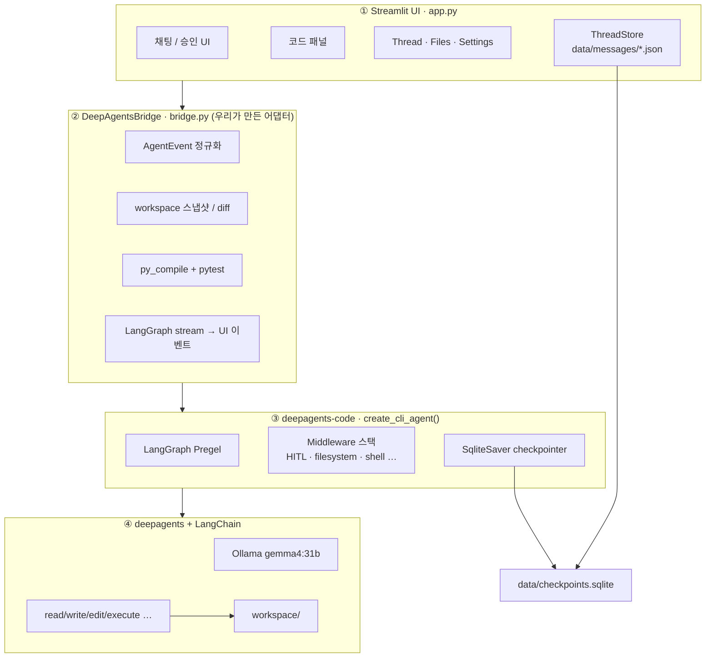

# Coding Agent

Streamlit 코딩 워크벤치. **에이전트 엔진은 [deepagents-code](https://pypi.org/project/deepagents-code/)** 이고, UI만 tasking-agent 스타일 3-pane.

모델: Ollama `gemma4:31b` (`ollama:gemma4:31b`)

## 구조




## 실행

```bash
curl -LsSf https://astral.sh/uv/install.sh | sh   # 없으면
cd ~/coding-agent
chmod +x run_app.sh
./run_app.sh
```

또는:

```bash
uv venv .venv --python 3.12
source .venv/bin/activate
uv pip install -r requirements.txt
streamlit run app.py
```

환경 변수:


| 변수                        | 기본                       |
| ------------------------- | ------------------------ |
| `CODING_AGENT_MODEL`      | `gemma4:31b`             |
| `CODING_AGENT_OLLAMA`     | `http://127.0.0.1:11434` |
| `CODING_AGENT_WORKSPACE`  | `./workspace`            |
| `CODING_AGENT_DATA`       | `./data`                 |
| `CODING_AGENT_MAX_ROUNDS` | `12`                     |


## Workbench (오른쪽 패널)


| 탭            | 기능                                                                                    |
| ------------ | ------------------------------------------------------------------------------------- |
| **Code**     | 파일 선택 후 `st.text_area`로 편집 · Save(확인 단계) · Reload · 미저장 표시                            |
| **Diff**     | 에이전트/사용자 변경 diff · Verification 결과                                                    |
| **Terminal** | 사용자 직접 명령 실행 (`workspace/` 고정, 확인 체크, Stop/History). **deepagents** `execute`**와 별도** |
| **Preview**  | `.html` 인라인 렌더 · `.py` Streamlit/Flask/FastAPI 프로세스 미리보기 (포트·SSH 안내)                  |
| **Trace**    | deepagents-code 활동 로그 (middleware 노이즈 필터)                                             |


## 참고

- [https://pypi.org/project/deepagents-code/](https://pypi.org/project/deepagents-code/)
- [https://github.com/FeynmanZhou/tasking-agent](https://github.com/FeynmanZhou/tasking-agent) (DeepAgentsBridge / 이벤트 정규화 UX)
- 이후 `research-memory` Coding Agent 페이지로 추가 예정

